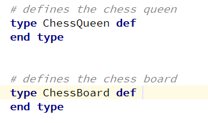
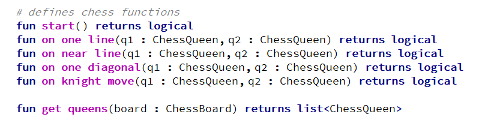

+++
title = "Domain model"
weight = 40
+++

## Domain object

Inside the domain model, you can create types using the keyword `type`, and then to use objects of this type in the arguments of domain functions and semantic predicates.

## Domain function

Inside the domain model, you can define domain functions using the keyword `fun`, and then to use this functions in semantic predicates.

