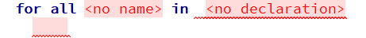
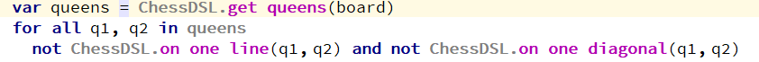
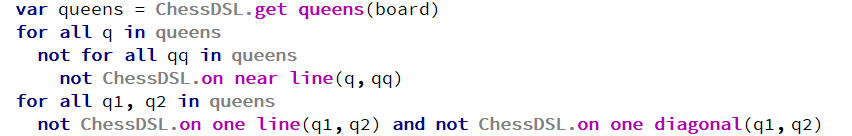

+++
title = "For all"
weight = 30
+++

To create `for all` logical expression, you must type the keyword `for`. Then the `for all` pattern appears.

The general form of this logical expression is `for all x1, x2... xn in listX Expression(x1,...,xn)`. It means that for every `<x1,..,xn>` from a list `listX` an expression `Expression(x1, ..., xn)` should be `true`.

#### For all example

{}
To calculate the result, a selection of various `<x1...xn>` combinations from a certain list is made. If such a selection cannot be made, it is considered that the formula was not calculated and the `for all` expression returns `true`. That is, if the list is empty, or of a smaller dimension than the vector `<x1...xn>`, you will end up with a `true`, and the formula inside `for all` will not be calculated.
{}
