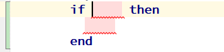

+++
title = "If implication"
weight = 25
+++

Implication as a `if` construction in d0sl is `false` only when the condition is `true`, and the `then` part is `false`. In other words, the implication `if(A) then B` is an abbreviated entry for the expression `not(A) or B`.

{}
Use the `if` keyword, and the editor will provide you with a template for the `if` construct.
{}

#### If example

