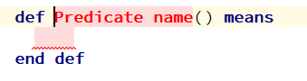

+++
title = "Predicate"
weight = 15
+++

In mathematical logic, a predicate is commonly understood to be a Boolean-valued function. However, we use the extended notion of a logical type instead of Boolean. And a predicate can return three values: **true**, **false**, and **none** (undefined).

{}
If the predicate returns **none**, you must treat this as an exception. For example, a timeout occurred. **none** means that the predicate could not calculate **true** or **false**.
{}

To create a predicate within the semantic model, you must type the keyword def. Then the predicate pattern appears. And you can specify the name of the predicate, its arguments, and the body of the predicate, which is a logical expression.



{}
The predicate name may contain spaces. Also you can use not only Latin, but also other national alphabets ..
{}

{}
The predicate pattern is created without arguments. To add an argument, place the cursor inside the parentheses and press Enter or Insert.
{}

{}
The predicate body can be any logical expression of d0sl language: `and`, `or`, `not`, `check all`, `if`, `for all`.
But for simplicity, we advise the body of the predicate to start with the `check all` instruction. `check all` instruction is equivalent of `and` instruction with many arguments each is in new line.
{}

#### Predicate example

```
def check board(board : ChessBoard) means 
  check all 
    var queens = ChessDSL.get queens(board) 
    for all q1, q2 in queens 
      not ChessDSL.on one line(q1, q2) and not ChessDSL.on one diagonal(q1, q2) 
  end 
end def
```