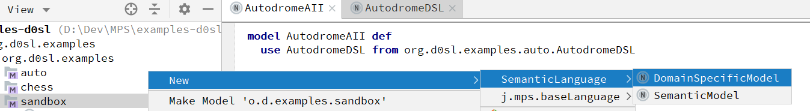

+++
title = "Semantic and Domain models"
weight = 5
+++

There are two kinds of root documents in d0sl - the Semantic Model and the Domain Specific Model.

Semantic Model is for defining semantic predicates and allows users to define logical rules.

Domain Specific Model defines objects and functions that can be used in Semantic Model but are specific for domain area. This is similar to C header file.


graph TB
    subgraph Domain Specific Model
    c1[Domain Model]-->c2[Domain objects]
    c1-->c3[Domain functions]
    end
    subgraph Semantic Model
    a1[Semantic model]-->a2[Predicates]
    end
    


To create a semantic or domain model, open the context menu by right-clicking on the sandbox, and then select new/SemanticLanguage/DomainSpecificModel or new/SemanticLanguage/SemanticModel.



#### Semantic Model example

```
model ChessAII def 
  use ChessDSL from org.d0sl.examples.chess.ChessDSL 
   
  def start() means 
    check all 
      ChessDSL.start() 
    end 
  end def 
   
   
  def check board(board : ChessBoard) means 
    check all 
      var queens = ChessDSL.get queens(board) 
      for all q1, q2 in queens 
        not ChessDSL.on one line(q1, q2) and not ChessDSL.on one diagonal(q1, q2) 
    end 
  end def 
   
  end def 
   
end ChessAII
```

#### Domain Model example

```
domain specific model Math def 
    # Math library                                            
                                                                                                   
    # Square root                                                      
    fun sqrt(value : numeric) returns numeric                          
                                                                        
    # Sinus and Cosinus                                                
    fun sin(value : numeric) returns numeric                           
    fun cos(value : numeric) returns numeric                           
                                                                        
    # Power function                                                   
    fun pow(value : numeric, power : numeric) returns numeric          
end Math
```