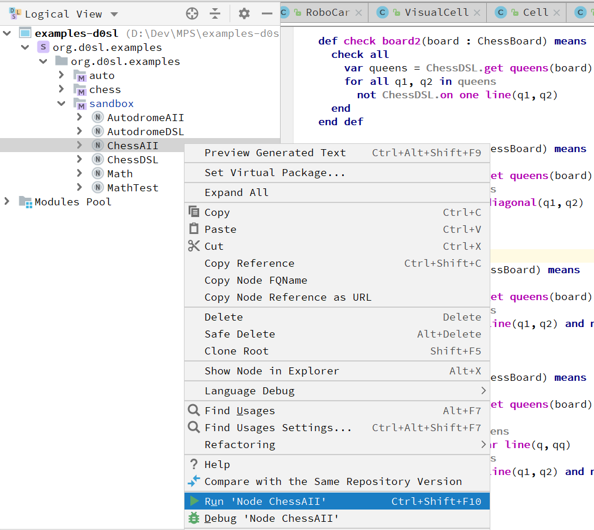

+++
title = "Project details"
weight = 5
chapter = false
pre = ""
+++

## To run the chess sample

+ Find a semantic model ChessAII in org.d0sl.examples/sandbox
+ Open the context menu on it by pressing the right mouse button. And select Run Node ChessAII.



## To change semantic

Semantic model is defined in sandbox/ChessAII. When the robot places the queens it calls `check board` predicate. In the semantic model in advance prepared several different predicates `check board`. Just change the name of the current `check board` predicate, and rename some other (e.g. `check board1` name to `check board`. And you can see how the behavior of the robot changes depending on the given semantics.

For example, the following model will forbid a robot to put queens on one line, but he will be able to arrange them on one diagonal.

```
def check board2(board : ChessBoard) means 
  check all 
    var queens = ChessDSL.get queens(board) 
    for all q1, q2 in queens 
      not ChessDSL.on one line(q1, q2) 
  end 
end def
```

{}
After each change of the model, do not forget to rebuild the MPS solution (Ctrl+F9).
{}

## Java part

You can find the Java part of the example in org.d0sl.examples/chess

> First of all, pay attention to the ChessDSL class, which, using annotations, indicates the domain specific functions to which we refer in our semantic model. For example

```java
/** 
  Represents a DSL for task: Arrangement of chess queens 
 */ 
 
@DomainModel(name = "ChessDSL") 
public class ChessDSL { 
   <...SKIPPED...>
  /** 
    Check if two queens are in the same horizontal or vertical 
    @param 
    @return 
   */ 
  @DomainFunction(name = "on one line") 
  public boolean onOneLine(ChessQueen q1, ChessQueen q2) { 
    if (q1.getCol() == q2.getCol() || q1.getRaw() == q2.getRaw()) { return true; } 
    return false; 
  } 
  /** 
    Check if two queens are in the same diagonal 
    @param 
    @return 
   */ 
  @DomainFunction(name = "on one diagonal") 
  public boolean onOneDiagonal(ChessQueen q1, ChessQueen q2) { 
    if (Math.abs(q1.getCol() - q2.getCol()) == Math.abs(q1.getRaw() - q2.getRaw())) { return true; } 
    return false; 
  } 
}
```

After that, in our semantic model, we can indicate in which class the implementation of predicates `on one line` and `on one diagonal`  can be found.

```
use ChessDSL from org.d0sl.examples.chess.ChessDSL
```

Also in class ChessRobot you can find how the robot calls predicate `check board` from semantic model. 

```java
try { 
  board.getBoard().setPieces(pieces); 
  LogicalConstant check = semantic.callPredicate("check board", board); 
  if (check.getValue() != Logical.TRUE) { 
    pieces[i][j] = null; 
    board.getBoard().setPieces(pieces); 
  } else { 
    boardPanel.setPiece(pieces[i][j], visit); 
    boardPanel.refreshUI(); 
    if (queenNumber == 7) { 
      return true; 
    } else { 
      if (arrange(pieces, new LinkedList(), queenNumber + 1)) { 
        return true; 
      } else { 
        pieces[i][j] = null; 
        board.getBoard().setPieces(pieces); 
        boardPanel.clear(visit); 
        boardPanel.refreshUI(); 
      } 
    } 
  } 
} catch (SemanticException e) { 
  e.printStackTrace(); 
}
```

{}
The algorithm is as follows: the robot puts the next queen and asks if everything is good. If the answer is positive, the robot tries to put the next queen, and if the answer is negative, the robot removes the last queen and searches for another cell for it. If a situation arises when it is impossible to place the next queen on any square, the robot goes back a step, cutting off the bad field.
{}