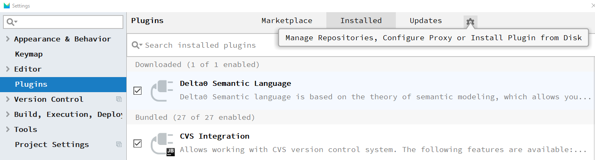
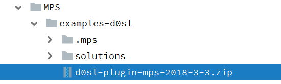
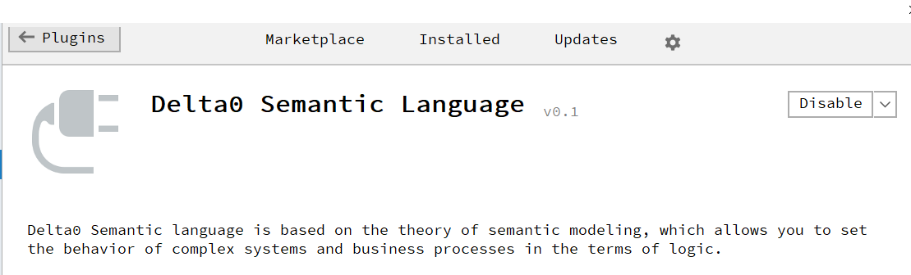

+++
title = "Installation"
weight = 10
+++

1. Install Jetbrains Meta Programming System (MPS) https://www.jetbrains.com/mps/
1. Clone the repo: `git clone https://github.com/kirikprotocol/examples-d0sl`
1. In MPS install d0sl plugin from file d0sl_plugin*.zip (choose load plugin from disk option)
  1. 
  1. 
  1. 
1. Open the project in MPS by choosing the directory cloned (e.g. examples-d0sl directory)
1. Rebuild the project